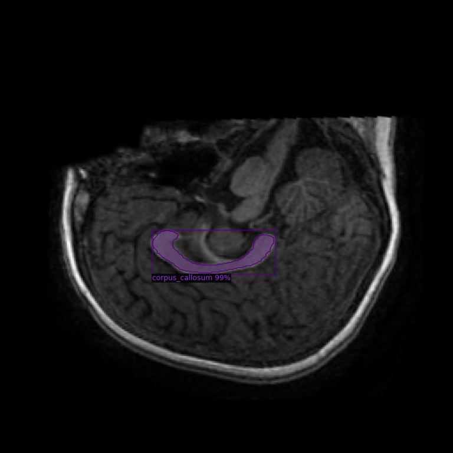
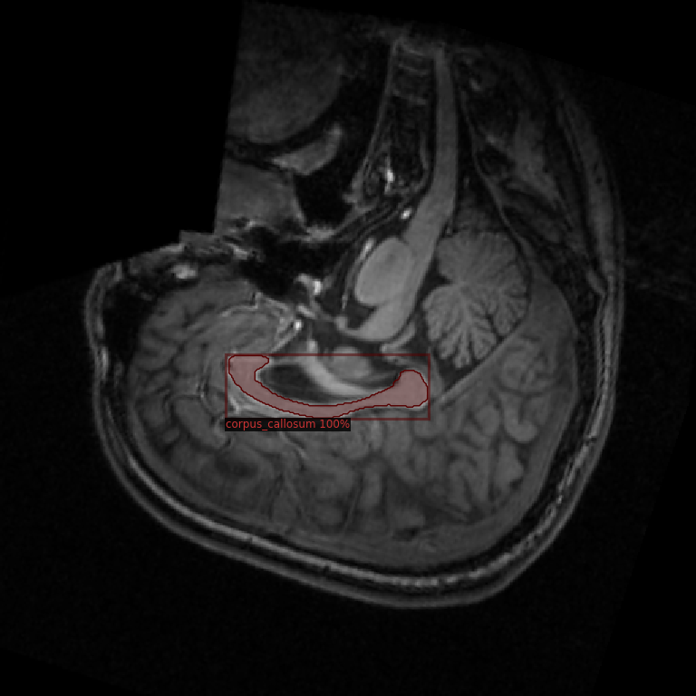
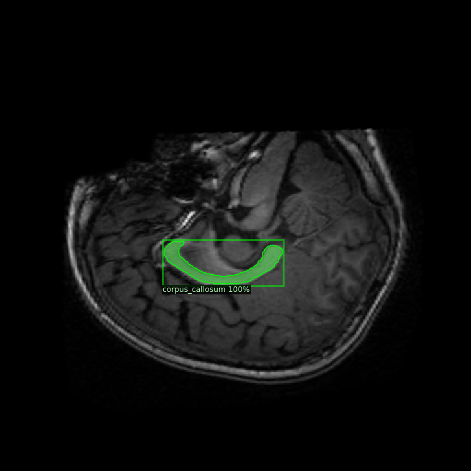

# Corpus Callosum Segmentation Workflow (`ccbrain`)

This folder contains a two-stage workflow for corpus callosum segmentation from ABIDE-derived MRI data:

1. **Local data preparation** in `cc_brain.ipynb`
2. **Google Colab training/inference** with Detectron2 in `ccBrainColab.ipynb`

The project uses ABIDE corpus callosum and brain segmentation derivatives as the source dataset.

## Folder Contents

- `cc_brain.ipynb`  
  Local notebook used to read ABIDE `.nii/.nii.gz` files, extract 2D slices, and generate paired PNG image/mask files in `OUT/IMG` and `OUT/MSK`.

- `ccBrainColab.ipynb`  
  Colab notebook used for model training and validation with **Mask R-CNN (Detectron2)**. It installs dependencies, loads prepared data, registers the dataset, trains the model, and runs sample predictions.

## Pipeline Summary

### Stage 1 - Local Dataset Preparation (`cc_brain.ipynb`)

This notebook is intended for **local execution** (Windows/Linux/macOS with Python environment).

Main operations:
- Loads ABIDE-derived files (example: `abide_msp.nii`, `abide_cc.nii`, `*_brain_seg.nii.gz`) using `nibabel`
- Iterates through subject folders (e.g., `*/session_1/anat_1`)
- Extracts midsagittal slices and corresponding corpus callosum masks
- Applies normalization and rotation (`np.rot90`)
- Converts masks to binary format
- Exports paired PNGs:
  - `OUT/IMG/<subject_id>.png`
  - `OUT/MSK/<subject_id>.png`

Result: a prepared segmentation dataset suitable for Detectron2 training.

### Stage 2 - Model Training in Colab (`ccBrainColab.ipynb`)

This notebook is intended for **Google Colab execution** (GPU-enabled runtime).

Main operations:
- Installs Detectron2 and dependencies
- Mounts Google Drive and unzips prepared dataset
- Builds Detectron2 dataset dictionaries from `OUT/IMG` and `OUT/MSK`
- Uses an **80/20 train-validation split** (`random.seed(42)`)
- Registers datasets (`cc_train`, `cc_val`)
- Trains **Mask R-CNN R50-FPN** (`COCO-InstanceSegmentation/mask_rcnn_R_50_FPN_3x.yaml`)
- Runs qualitative inference on random validation images using `DefaultPredictor`

Important training settings currently used:
- `SOLVER.IMS_PER_BATCH = 2`
- `SOLVER.BASE_LR = 0.00025`
- `SOLVER.MAX_ITER = 1500`
- `MODEL.ROI_HEADS.NUM_CLASSES = 1` (corpus callosum)
- `MODEL.ROI_HEADS.SCORE_THRESH_TEST = 0.75` (inference)

## Recommended Execution Order

1. Run `cc_brain.ipynb` locally to generate `OUT/IMG` and `OUT/MSK`
2. Compress or copy the `OUT` directory to Google Drive
3. Run `ccBrainColab.ipynb` in Colab for training and inference
4. Collect model outputs from `cfg.OUTPUT_DIR` (e.g., `model_final.pth`)

## Expected Data Structure

### Input (ABIDE derivatives)

The local notebook expects ABIDE-derived files under a structure similar to:

```text
abide.cc.bvol.20150121/
  abide.cc.bvol.20150118/
    <SITE>/
      <SUBJECT_ID>/
        session_1/
          anat_1/
            abide_msp.nii
            abide_cc.nii
            *_brain_seg.nii.gz
```

### Output (prepared training data)

```text
OUT/
  IMG/
    <subject_id>.png
  MSK/
    <subject_id>.png
```

## Environment Requirements

### Local (`cc_brain.ipynb`)
- Python 3.x
- `nibabel`
- `numpy`
- `matplotlib`
- `opencv-python`
- `imageio`

### Colab (`ccBrainColab.ipynb`)
- Google Colab runtime (GPU recommended)
- PyTorch with CUDA (provided by Colab runtime)
- Detectron2 (installed inside notebook)

## Notes and Practical Guidance

- Keep image-mask filenames synchronized (`IMG/<id>.png` <-> `MSK/<id>.png`).
- Verify masks are non-empty before training (already partially handled in local preprocessing).
- If you change image resolution or orientation, keep consistency across both images and masks.
- For larger datasets or longer training, increase `MAX_ITER` and track validation quality.
- Add quantitative evaluation (Dice/IoU) if you want metric-driven model selection.

## Qualitative Results (Validation/Test Predictions)

The following screenshots show example predictions generated on held-out test/validation data:

- `ss`
- `ss1`
- `ss2`

If your image files are stored next to this README as `ss.png`, `ss1.png`, and `ss2.png`, they can be displayed directly as:





## Dataset Source and Attribution

This work uses ABIDE corpus callosum and brain segmentation derivatives published here:

- [ABIDE corpus callosum and brain segmentation data](https://sites.google.com/site/hpardoe/cc_abide)

If you use the same data, please follow the citation and acknowledgment guidance provided on the dataset page.

## Disclaimer

This repository is for research/educational workflow development.  
Clinical use requires rigorous validation, regulatory compliance, and expert oversight.

